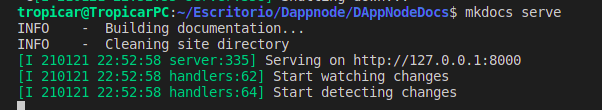

# DAppNode Docs

## Getting started

### Installation in Ubuntu

To contribute to this documentation, your machine requires the next programs installed:

* pip
* pymdown-extension<6.3
* markdown<3.2
* mkdocs
* mkdocs-material
* git

Usually, Linux systems have pip installed by default, you can check with the next command:

~~~
pip --version
~~~

The easiest way to install mkdocs, mkdocs-material and their dependencies are with the next command:

~~~
python -m pip install "pymdown-extensions<6.3" "markdown<3.2" mkdocs mkdocs-material
~~~

The above command is installing the dependencies of the theme mkdocs-material correctly. If you install mkdocs-material directly, pip will automatically install the latest version of pymdown and markdown, both are incompatible with the mkdocs-material theme.

The next step is to download the repository and access to the main directory:

~~~
git clone https://github.com/dappnode/DAppNodeDocs.git  &&  cd DAppNodeDocs/
~~~

Once you have download only have to type the following command to begin to work locally:

~~~
mkdocs serve
~~~



Now you can edit the project locally in real time and check the changes on the direction <code>127.0.0.1:8000</code>.

### Common Errors on Ubuntu installation

#### Reload the environment variables after installation

If you have installed mkdocs and it does't appear , try to reload the <code>.bashrc</code> file, the next command execute that file and actualize the environment variables, maybe mkdocs was installed but it does not actualize the environment variables.

~~~
source  ~/.bashrc
~~~


### MacOs Installation

[Install mkdocs](https://www.mkdocs.org/#installation). In the case of MacOS you can do so with Homebrew

```
brew install mkdocs
```

Then run a local server to have a live auto-refresh preview of the docs

```
mkdocs serve
```

Now navigate to http://127.0.0.1:8000/
