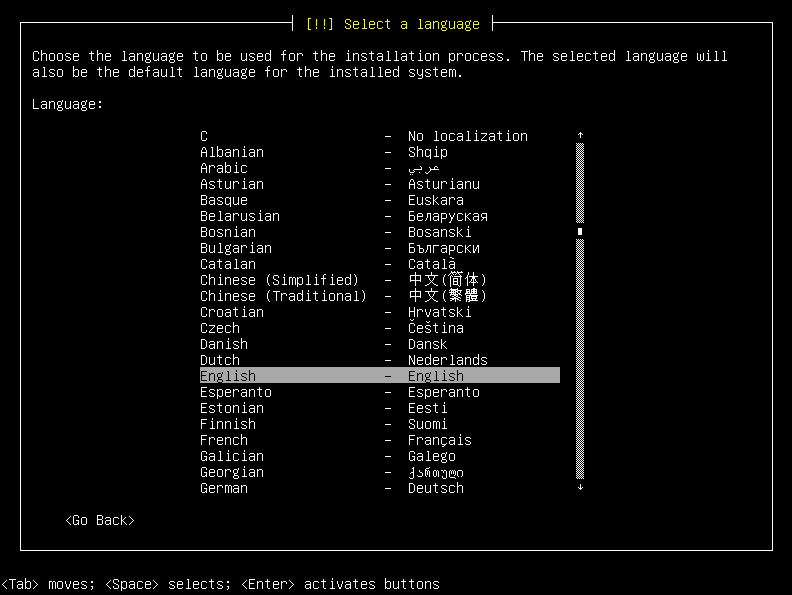
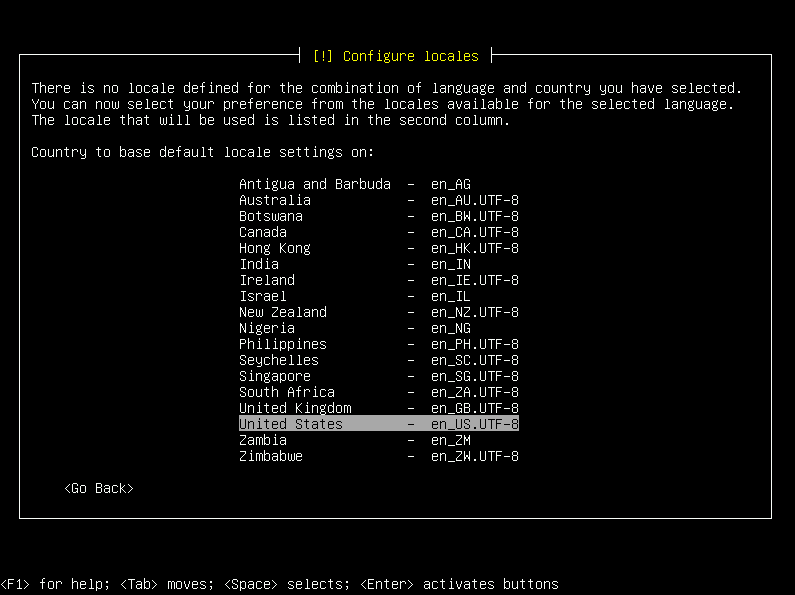
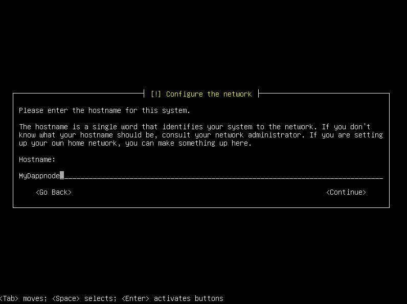
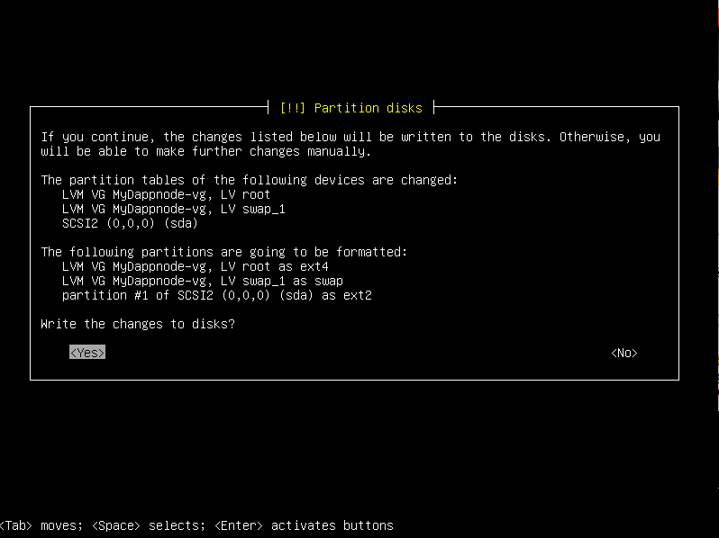

# ISO Installation

Installing from the official DAppNode ISO will wipe the existing machine data and replace it with a Debian operating system and DAppNode. 

# ISO Installation on an Intel NUC
If you are installing DAppNode on an Intel NUC 10+ that was not purchased through DAppNode, please ensure you have upgraded your BIOS to the latest version.  All units we ship out are upgraded and confirmed to work with the current software. Instructions for downloading and installing these updates can be found on the manufacturer's website [here](https://www.intel.com/content/www/us/en/support/articles/000005636/intel-nuc.html) or [here](https://www.intel.com/content/www/us/en/support/articles/000033291/intel-nuc.html) depending on model.  All downloads of firmware, BIOS files, and software can be found on both above links.

## Get the ISO

You can get the image downloading directly from [DAppNodeISO](https://iso.dappnode.io/) or if you prefer you can [build it from the source](https://github.com/dappnode/DAppNode#install-dappnode-with-iso).

## Burn the ISO in a USB

Burn the ISO to an USB stick. To do so we recommend using [Etcher](https://www.balena.io/etcher/) for the OS with which you will prepare the USB to boot from your server and install DAppNode

> :warning: Please note that Etcher is intended to generate the ISO image in a bootable USB from your desktop device, and then install it in a server

IF YOU EXECUTE THE BOOTABLE USB IN A MACHINE CONTAINING DATA, ALL EXISTING DATA WILL BE ERASED.

Also, DAppNode is intended to run 24/7 so if you install it on a laptop or desktop machine and you turn it off, it will not stay synced.

## Boot from ISO

> :warning: If you encounter a corrupted display during installation, ensure BIOS boot mode is: UEFI.

Insert the USB into your Server and prepare to install a Debian distribution. You will have to make sure that your Server boots from the USB. If you succeed at booting up from your USB, you will be greeted with this screen or a similar one:

    

Select a language.

    

Select a location.

    

    

Select a keyboard configuration.

    

Type a hostname. This is the name your machine will have on the network. It's not important.

    

Define a password for the user root.

    

> :warning: Write down this password, you will need it in case you need to access as root to the command line interface (cli) of DAppNode.

Select a username for your DAppNode and set a password.

    

> :warning: Write down this DAppNode username and password.

    

Set up your time zone.

    

Partition disk configuration. On this guide we will use the second option **Partitioning method: [Guided - use entire disk and set up LVM]**.

    

After choosing the disk, we need to define the partioning scheme. We will select **All files in one partition (recommended for new users)**.

    

Confirm we will write the disk.

    

We want to use all the disk ont he partioning process. So we dont modificate the value.

    

Confirm we want to write the changes to disks.

    

The next decision depends on you. We recommend you choose 'Yes' because you don't have to confirm all the operations.

    

Install the grub.

    

Select the disk.

    

If you have an IP you should define here. Otherwise, leave the field blank.

    

You will see this message indicating you have finished this installation.

    

The machine will restart and you will see this screen.

    

Log in into the machine with the DAppNode username and password you chose earlier.

## Post-Installation

Once the installation process has finished, DAppNode will try to automatically prepare the first access to your DAppNode on the next order:

1. [Local Proxy](../../../../user-guide/ui/access/local-proxy)
2. [Wifi](../../../../user-guide/ui/access/wifi)
3. [Wireguard](../../../../user-guide/ui/access/vpn#wireguard)
4. [OpenVPN](../../../../user-guide/ui/access/vpn#openvpn)
