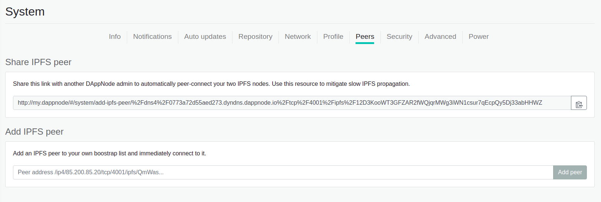

# Add IPFS Peers

In this section, firstly you will read about what is IPFS and how it can affect to your DAppNode. Then, you will see a guide how to add IPFS peer and how to get a link of your IPFS for sharing with other users.

## IPFS on DAppNode

### What is IPFS?

Shortly, IPFS is a protocol to share data between machines. On your DAppNode when you go to the DAppStore and you are installing a package, what is happening behind the scene is the next:

1. DAppNode machine gets the IPFS address from the ethereum blockchain.
2. DAppNode machine uses this address to find the content associated with this link.

### Why is important to add peers?

The searching process is the key to understand why is important to add peers. When your DAppNode is going to search the content associated with this link or hash. Firstly, it will ask the nearest peers to it. If it's popular information, probably the research will be fast, but in case, the information is more peculiar, it requires asking for this content for peers that are not connected to you directly. Then, if you are connected to so many peers, the propagation of the information is faster and is more probable that some of your closed peers have the information you want.

### How it affects to DAppNode?

Firstly, DAppNode has a server with all the packages. In this way, we are sure all the packages are available. But the way your machine download a package to install it or even detects that there is an update of a package is by asking the nearest peers of your machine. Then, the best way to improve the propagation of the information, in this case, the release of a package, it's adding peers to your DAppNode.

## Sharing IPFS peer

You should go to the System > Peers or you can try to [use this link](http://my.dappnode/#/system/add-ipfs-peer) if you are connected vpn or via wifi.

    

### Get your IPFS peer link

To get the link to share with others. Simply click copy the content of the first field (Share IPFS peer).
In my case it would be:

`http://my.dappnode/#/system/add-ipfs-peer/%2Fdns4%2F0773a72d55aed273.dyndns.dappnode.io%2Ftcp%2F4001%2Fipfs%2F12D3KooWT3GFZAR2fWQjqrMWg3iWN1csur7qEcpQy5Dj33abHHWZ`

### Add a peer to your DAppNode

When a user pass you his link, you just have to paste on the second field (Add IPFS peer
) and click on the **Add peer** button.
