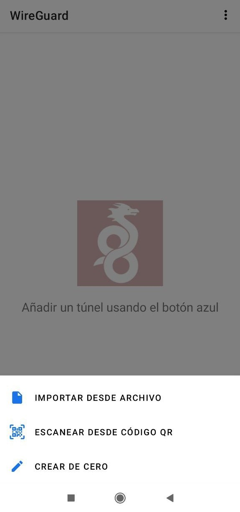

# Add VPN Devices

Firstly, if you don't know what VPN is, below you can read a little description you can find on the Internet.

_A virtual private network, or VPN, is an encrypted connection over the Internet from a device to a network. The encrypted connection helps ensure that sensitive data is safely transmitted. It prevents unauthorized people from eavesdropping on the traffic and allows the user to conduct work remotely._

The main purpose of setting up the VPN access is to let the user safely connect to his DAppNode in case he wants to access it remotely.

DAppNode is compatible with 2 kinds of VPN clients. Wireguard and OpenVPN. This process has three parts:

- Prerequisites.
- Create the configuration file and select the client.
- Set up the client in the device you want to use to access your DAppNode.

## Prerequisites

To set up VPN correctly, you need to open the ports 8092 TCP and 1194 UDP. You have to enter the router admin UI to do it. Usually you can set up this kind of things on the **port forwarding** sections of your router, but we would recommened you research for internet how to do it with your router.

## Select what client you want to use and create the configuration file

You can use openvpn or wireguard. You are free to set up whatever you prefer or even both. Firstly, go to the VPN page, you can do it by clicking on the VPN on the right menu of the UI. Select the tab of the vpn you want to set up.

    

In case wireguard is not installed and you want to use it, intall the package by clicking on the link.

## Wireguard

If you have wireguard package installed you should see this page after clicking wireguard tab:
Once you have installed the Wireguard package, you will be able to see this page:

    

You can use the profile is created by default. Or create a new one and delete this. To create a new one follow the next steps.

1. Type a name for your device on the field **Add Device** and click on the button o press intro.

    

If the device was created correctly, this one will appears below.

    

2. Click on the button **Get link** of this device you have created. You will be redirected to the next page:

    

If you will use a wireguard client in a laptop or pc you need to copy that text, it's the configuration of wireguard for the device that you have added. You can copy it by clicking on the **Copy remote config**.

In case you will use the wireguard client in a mobile, you can obtain this file easier. Click on the button **Show remote config QR code**. This will show a QR you can scan from your mobile that download the configuration file.

3. The next step is to set up the client, we mean the device from you will access to your DAppNode.

hese are the recommended Open VPN clients for each OS:

- macOS: [WireGuard for macOS](https://www.wireguard.com/install/#macos-app-store)
- iOS: [WireGuard for iOS](https://www.wireguard.com/install/#ios-app-store)
- Windows: [WireGuard for Windows](https://www.wireguard.com/install/#windows-7-8-81-10-2012-2016-2019)
- Android: [WireGuard for Android](https://play.google.com/store/apps/details?id=com.wireguard.android)
- Linux: [WireGuard for Linux](https://www.wireguard.com/install/#ubuntu-module-tools)

### Linux

To use wireguard in ubuntu, you will need to use the terminal in the installation process. Firstly, it is needed to install the prerequisites:
`sudo apt install openresolv`

Then, you can install Wireguard:
`sudo apt install wireguard`

Create the configuration file and paste the configuration you have copied before (The configuration text you have obtained on the wireguard tab on dappnode UI):
`sudo nano /etc/wireguard/wg0.conf`

Finally, type the following command:
`sudo wg-quick up wg0`

To check you are connected you can do 2 things:

1. `ifconfig` and check if there is an interface "new".
2. Try to access the dappnode UI, if you can access it's ok.

In case you can, type:
`sudo wg show`

The output of this command should be something like:
`~$ sudo wg show interface: wg0 public key: zFhjLJdXrLl86ayX6JpyfN0/rVH+qxgF/e8HxRP9cxk= private key: (hidden) listening port: 51820`
`peer: OQZWpDPUcNPRZMjncY6BUwsli6HtqgTUn2lAGdXVi2c= endpoint: 173.249.33.176:51820 allowed ips: 172.33.0.0/16 latest handshake: 36 seconds ago transfer: 222.36 KiB received, 81.86 KiB sent`

### MacOS

Content to be added soon.

### iOS

Content to be added soon.

### Windows

Content to be added soon.

### Android

In your mobile, go to the playstore, then look for `wireguard` and select this app and install it:

    

Then, if you open the app you will see the next image:

    

Click on the blue circle button on the right bottom:

    

You can obtain the configuration scanning the QR you obtain on the vpn/wireguard view, download the file and import it or copy the contain of the configuration.

## OpenVPN

    

You can use the profile is created by default. Or create a new one and delete this. To create a new one follow the next steps.

1. Type a name for your device on the field **Add Device** and click on the button o press intro.

    

If the device was created correctly, this one will appears below.

    

2. Click on the button **Get link** of this device you have created. You will be redirected to the next page:

    

These are the recommended Open VPN clients for each OS:

- Mac os: [Tunnelblick](https://tunnelblick.net/)
- Ios: [Open VPN connect](https://itunes.apple.com/us/app/openvpn-connect/id590379981)
- Windows: [Open VPN (community installer)](https://openvpn.net/community-downloads/)
- Android: [Open VPN for Android](https://play.google.com/store/apps/details?id=de.blinkt.openvpn)
- Linux: Already included in recent versions.

### Linux

#### Ubuntu / NetworkManager

OpenVPN comes installed in Ubuntu recent versions, but to be sure, follow these steps. Run the terminal application:

    

Install OpenVPN and plugin for NetworkManager:

    sudo apt-get install network-manager-openvpn-gnome openvpn

Once the installation is complete, restart Network Manager by typing:

    sudo service network-manager restart

Go to "Settings -> Network" and click to the "+" button to add a VPN connection:

    

Select "Import from file..."

 

    

Browse the filesystem to select the downloaded file:

    

Add the profile with the default settings:

    

Now you can connect selecting the profile from the network tray icon:

    

### MacOS

The recommended OpenVPN client is Tunnelblick and you can download it [here](https://tunnelblick.net)

    

Once you have followed the steps to install the tunnelblick client in your MAC, download the file from the URL given in the console to download the OVPN file with your credentials.

If you have already downloaded the config file before installing Tunnelblick, you can select the "I have a config file" option and browse to its location. If not, once you have downloaded the OVPN file, just double click on it and Tunnelblick will add the config for you.

Select your preferred option about the users that will have access to the config.

    

The system will probably ask for your admin password to install the VPN configuration, and it is done!

    

Just open Tunnelblick in your MAC and click on Connect DAppNode.

    

Once connected you can already access http://my.admin.dnp.dappnode.eth with your new OpenVPN connection!

    

### iOS

The recommended OpenVPN client is OpenVPN Connect and you can download it [here](https://itunes.apple.com/us/app/openvpn-connect/id590379981?mt=8)

    

Once you have installed it you can just scan the QR code and hit download:

    

and click in "Open in OpenVPN"

    

Tap the add button and name your connection

    

The phone will ask you permission for OpenVPN to add a configuration profile , please do.

And it is done, you can just connect to your new OpenVPN now

    

 
  
After a few seconds, you will see in the OpenVPN interface that you are connected. You can either connect to your server through the OpenVPN app or directly from the phone´s "VPN" menu in "Settings"

    

Once connected you can access http://my.admin.dnp.dappnode.eth with your new OpenVPN connection!

### Android

Install **OpenVPN for Android** from [Google Play](https://play.google.com/store/apps/details?id=de.blinkt.openvpn) or [F-Droid](https://f-droid.org/en/packages/de.blinkt.openvpn/):

    

Download the OpenVPN profile from the URL or scanned QR code:

    

Open the downloaded file and import it to the application, then save it with your preferred name:

    

Select the saved profile to connect to it:

    

Accept the connection request:

    

You should see a connection log similar to this:

    

Once connected, you should be able to browse the DAppNode Admin page:

[http://my.admin.dnp.dappnode.eth](http://my.admin.dnp.dappnode.eth)

    

### Windows

Download the recommended client for [OpenVPN WINDOWS INSTALLER (NSIS)](https://openvpn.net/community-downloads/) and follow the steps to install it:

    

    

    

Download the file from the provided link by the DAppNode administrator.

    

Run the OpenVPN GUI program:

    

Select "Import file..." from the tray bar icon (right click):

    

Select the downloaded file:

    

Finally, select "Connect" from the tray bar icon menu:

    

