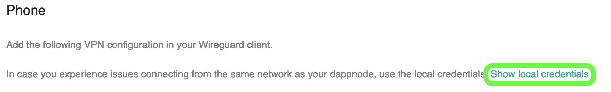
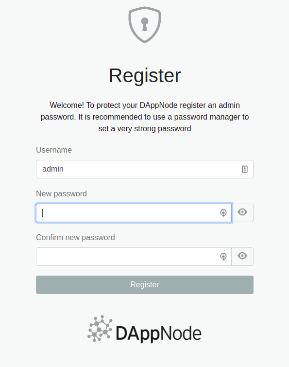
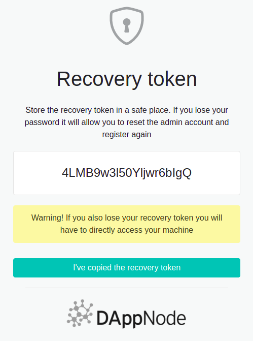

<details>
  <summary>Help! I can't access my Dappnode!</summary>
  <div>
    <div>
    If it is your first time trying to access your Dappnode, please try one of the following steps:
    <br /><br />
<ul>
    <li>If you are connected to the same network as your Dappnode via wired Ethernet, try to access the UI using the address <a href="http://dappnode.local">http://dappnode.local</a></li>
    <li>If you've bought a Dappnode or installed it on a machine with integrated Wi-Fi, try to access the Wi-Fi hotspot 'DAppNodeWifi'.</li>
</ul>

If all of the above does not work, visit our <a href="https://discord.com/invite/dappnode">Discord</a> and ask for help in the #support channel.
</div>
  </div>
</details>

<details>
  <summary>Why can't I connect to my Dappnode via VPN?</summary>
  <div>
    <div>
    If you have set up <b>OpenVPN</b> and you cant access your Dappnode, remember that you might need to set up port forwarding on your router. Sometimes the feature called 'UPnP' enables these ports on your router automatically but this sometimes does not work or is not available on your router.
    <br /><br />

To do this, you need to access your router configuration and "port-forward" the following ports: TCP Port 8092 and UDP Port 1194. 
<br />
In case you have set up <b>WireGuard</b>, you might need to "port-forward" the following port: 51820
<br /><br />

Once you have done that <i>AND</i> you still can not access your Dappnode, you might have to create two profiles:

<ul>
    <li>A Local profile: This profile is used when you are connecting from within the same network that the Dappnode resides in.</li>
    <li> A Remote profile: This profile is used when you are connecting from a different network than the one where your Dappnode resides in.</li>
</ul>
  When you create the VPN profiles, there is a link that generates that toggles config creation for either local or remote usage.
  <br /><br />
  <p align="center">
  
  </p>

You can also check out our guides on how to configure VPN access <a href="/user/guides/access/vpn">here</a>.
</div>
  </div>
</details>

 [//]: # "We have to place the recovery tag here for it to show the bottom details tag" 
<details id="recovery"> 
  <summary>Can I recover a lost admin password?</summary>
  <div>
    <div>
    You can not outright recover your admin password but you can regain access to your Dappnode if you wrote down the recovery token provided during the initial setup. 
    <br /><br />
    More about the initial setup can be found <a href="/user/quick-start/first-steps">here</a>
    <br /><br />
</div>
  </div>
</details>

<details>
  <summary>How do I recover a lost admin password using my recovery token?</summary>
  <div>
    <div>
    Visit the login page of your Dappnode:
    <br /><br />
    <p align="center">
    
    </p>

You will then see the option 'Forgot password?' underneath the 'Login' button. Once you click that, a new input field will appear where you can input your recovery token. We will use <code>4LMB9w3l50Yljwr6bIgQ</code> in this example.
<p align="center">
    
</p>
If you have entered the correct recovery token, you'll then be prompted to enter a new admin password.
<br /><br />
<p align="center">
    
</p>
Once you've filled out those fields and pressed 'Register', your Dappnode will once again provide you a recovery token. <b>Do not forget to write down and save this one!</b>
<p align="center">
    
</p>

</div>
  </div>
</details>

<details>
  <summary>What do I do if I lost the password AND my token?!</summary>
  <div>
    <div>
In the case where you have lost both the password and the recovery token, you will need either SSH or local access to the Dappnode machine.
<br /><br />
Once you are connected to your Dappnode, type the following command which prints the recovery token to the terminal:

```
cat /usr/src/dappnode/DNCORE/admin-recovery-token.txt ; echo
```

The command does the following:

- Reads the admin-recover-token.txt file where the token is saved.
- The <code>; echo</code> is used to make it easier to read and copy the token.

After inserting the command above, you can obtain the recovery token and use that one to recover your admin access.

 [//]: # "Recovery tag anchors to details element above, even though we set it to the one above it." 

In the section above ('<b><a href='#recovery'>"How do I recover a lost admin password using my recovery token?</a></b>') you can check out how to use your token to regain access.

</div>
  </div>
</details>

<details>
  <summary>How do I force update my Dappnode without losing data?</summary>
  <div>
    <div>
    If you are experiencing an issue or just want to make sure you are running the latest Dappnode version, execute this command below in the Dappnode terminal. 
    <br /><br />
    This will update the core packages to the latest versions without erasing any data from your Dappnode.
    <br /><br />
    ⚠️ This will clear any EXTRA_OPTS fields, but no chain data, keys, or other configurations will be affected ⚠️
    <br/><br />
<code> sudo wget -O - https://installer.dappnode.io | sudo UPDATE=true bash` </code>
</div>
  </div>
</details>