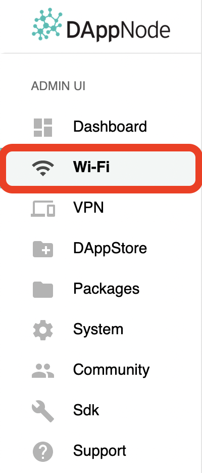
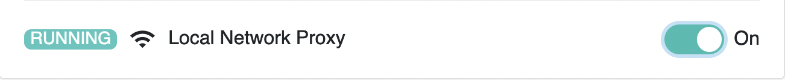

# Local network access to Dappnode
---
## How to access your Dappnode
If you have installed your Dappnode via script, an ISO file or are connected to the same network as your Dappnode you will be able to access the Dappnode Admin UI by visiting http://dappnode.local.

> :warning: **Important**: When you use the local network proxy you are limited to the Admin UI dashboard at `dappnode.local` and cannot access any other features such as blockchain clients (Ethereum, Gnosis Chain, etc). You must configure and use [a VPN](vpn) or the DAppNodes included WiFi hotspot to access those features. :warning:

## Enable or disable local network access

If you have no use for local network access because you're using the VPN features or the included WiFi hotspot, you can also disable (and of course enable it again later) in the WiFi sidebar menu on your Dappnode:

    

Switch to the `Local Network` tab:

    

And toggle the local network functionality:

    

