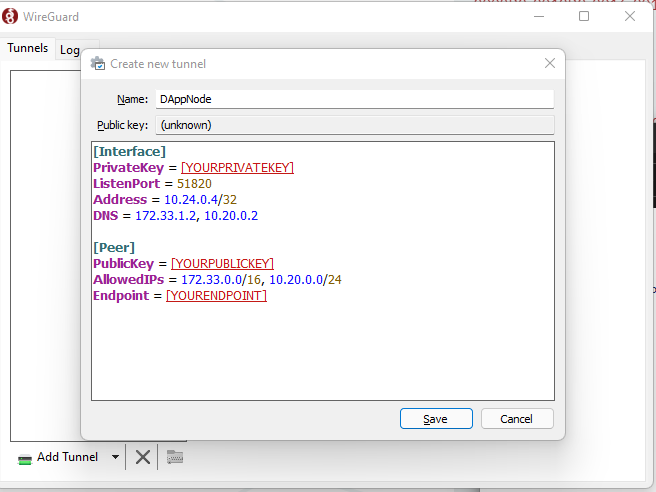

# Accessing your Dappnode via VPN
---

## Introduction to VPNs

If you don't know what a VPN (Virtual Private Network) is, here is a little description:

> A virtual private network, or VPN, is an encrypted connection over the Internet from a device to a network. The encrypted connection helps ensure that sensitive data is safely transmitted. It prevents unauthorized people from eavesdropping on the traffic and allows the user to conduct work remotely.

The main purpose of the VPN is to provide a secure connection to your Dappnode when you need remote access to its hosted services (eg. Blockchain clients or IPFS) or your Dappnode itself (eg. updating packages). 

Dappnode supports 2 different kinds of VPN protocols and software: **WireGuard** (preferred) and **OpenVPN**.  

This document is structured as follows:

- [**Selecting a VPN client in the admin UI**](#selecting-a-vpn-client-in-the-admin-ui): Explains how to access and select a VPN client in the Dappnode UI
- [**WireGuard** (preferred)](#wireguard-preferred): Explains how to set up WireGuard on your Dappnode, configure a profile and how to connect your devices using WireGuard clients
- [**OpenVPN**](#openvpn): Explains how to set up OpenVPN on your Dappnode and how to connect your devices using OpenVPN clients
- [**Setting up a VPN client from the Dappnode terminal**](#setting-up-a-vpn-client-from-the-dappnode-terminal): Read this section if you want to access via VPN directly, or your machine has not wifi interface.

## Selecting a VPN client in the admin UI
> :warning: Please connect to your DAppNodes WiFi or local network access before you attempt these steps. :warning:

So select a VPN client, choose the `VPN` menu item in the left sidebar or click [this link](hhttp://my.dappnode/#/vpn/WireGuard). You will see a page where you can select either WireGuard or OpenVPN.

    

If you want to set up WireGuard, follow the [WireGuard instructions](#WireGuard-preferred).  
On the other hand, if you wish to use OpenVPN, click on the OpenVPN tab and install the OpenVPN package. Continue with the [OpenVPN instructions](#openvpn).

    

## WireGuard (preferred)

On the WireGuard tab, you'll be able to see the default profiles. By default we create a single profile, called `dappnode_admin`.

    

### Gathering your VPN credentials
The steps on how to get your VPN credentials are the same across all clients and platforms. If you wish, you can create a new as follows:

    

After the successful creation of that profile, click on `Get link`. This will prompt you with the configuration text for your WireGuard client. Keep this window open for later, you will need to paste this configuration text into your respective WireGuard client or you can download the configuration as a text file.

> :warning: If you want to access your Dappnode with multiple devices, make sure to create a configuration profile for each and every device that hosts a WireGuard client :warning:

These are the recommended WireGuard clients:

- macOS: [WireGuard for macOS](https://www.wireguard.com/install/#macos-app-store)
- iOS: [WireGuard for iOS](https://www.wireguard.com/install/#ios-app-store)
- Windows: [WireGuard for Windows](https://www.wireguard.com/install/#windows-7-8-81-10-2012-2016-2019)
- Android: [WireGuard for Android](https://play.google.com/store/apps/details?id=com.wireguard.android)
- Linux: [WireGuard for Linux](https://www.wireguard.com/install/#ubuntu-module-tools)

### Linux
> :warning: These steps require a terminal :warning:

To install WireGuard on Linux, please take a look at `WireGuard for Linux` page linked above and look for the corresponding Distribution you're using.

After installing WireGuard, you'll need to create the config file and copy the content of the Dappnode UI there (the configuration you obtained in the steps above):  
`sudo nano /etc/WireGuard/wg0.conf` or  
`sudo vim /etc/WireGuard/wg0.conf`
    
Finally, type the following command (this starts the WireGuard client and connects the VPN interface):  
`sudo wg-quick up wg0`

:tada: Now you're ready to connect to your Dappnode! :tada:   

Disconnect from your DAppNodes WiFi hotspot if connected and connect to your usual WiFi network or wired connection.  

To check if you are connected you can try a few things:

1. Type `ifconfig` and check if there is a new interface you're not familiar with
2. Ping the Dappnode interface with `ping my.dappnode`
3. Try to access the [Dappnode UI](http://my.dappnode/)

If you want to see some statistics, type:
`sudo wg show`

The output of this command should look something like this:

    $ sudo wg show
    interface: wg0 public key: zFhjLJdXrLl86ayX6JpyfN0/rVH+qxgF/e8HxRP9cxk=
      private key: (hidden)
      listening port: 51820
    peer: OQZWpDPUcNPRZMjncY6BUwsli6HtqgTUn2lAGdXVi2c=
      endpoint: 173.249.33.176:51820
      allowed ips: 172.33.0.0/16, 10.20.0.0/24
      latest handshake: 36 seconds ago
      transfer: 222.36 KiB received, 81.86 KiB sent

> :warning: If it seems that you can't connect to your Dappnode, check the [troubleshooting steps here](../../../user/faq/troubleshooting#why-cant-i-connect-via-vpn-to-my-dappnode)

### macOS

To install the official WireGuard macOS client, head to the [Mac App Store](https://www.WireGuard.com/install/#macos-app-store) link and install the client.

After installing the client, open your Finder, click `Go` in the menu bar and choose `Applications`.

    

In the list of Applications, search for `WireGuard`. Double-click the Application. A new icon will appear in the top menu bar, containing the WireGuard logo. 

Click on that icon and select `Manage Tunnels`. Proceed by adding a new empty tunnel as pictured:

    

Give your WireGuard profile a name (preferably the one you also set in the Dappnode VPN UI). Copy and paste the configuration text into the big textbox as in the example below:

    

:tada: Now you're ready to connect to your Dappnode! :tada:   

Disconnect from your DAppNodes WiFi hotspot if connected and connect to your usual WiFi network or wired connection.  

Click on the WireGuard icon in the menu bar once more and select the profile you just created, in this example `Dappnode`:

    

To check if you have successfully connected to your Dappnode, try opening the [Dappnode Dashboard](http://my.dappnode). 

> :warning: If it seems that you can't connect to your Dappnode, check the [troubleshooting steps here](../../../user/faq/troubleshooting#why-cant-i-connect-via-vpn-to-my-dappnode)

### iOS

Open the iOS AppStore, search for `WireGuard` and install the following App.

    

Open up the app and select `Add a tunnel`, followed by your preferred option:

    

You can then either scan the QR code that is created when you take a look at your VPN profile in the Dappnode VPN UI, import the configuration file that you can download or input all the data yourself.

:tada: Now you're ready to connect to your Dappnode! :tada:   

Disconnect from your DAppNodes WiFi hotspot if connected and connect to your usual WiFi network.  

> :warning: If it seems that you can't connect to your Dappnode, check the [troubleshooting steps here](../../../user/faq/troubleshooting#why-cant-i-connect-via-vpn-to-my-dappnode)

### Windows

To install WireGuard on Windows, you can download the installer, linked [here](https://download.wireguard.com/windows-client/wireguard-installer.exe). 

After installing WireGuard, press the Windows key and search for `WireGuard`. A new windows should pop up:

    

You can then either press `Import tunnel(s) from file` or click on the little arrow, next to `Add Tunnel` and click `Add empty tunnel...` to add your WireGuard config which you have opened or downloaded above. Don't forget to also give your tunnel a name:

    

Now you're ready to connect to your Dappnode! Click on the, in the screenshot highlighted in green, `Activate` button:

    

:tada: Now you're ready to connect to your Dappnode! :tada:   

Disconnect from your DAppNodes WiFi hotspot if connected and connect to your normal WiFi network or wired connection.  

To check if you have successfully connected to your Dappnode, try opening the [Dappnode Dashboard](http://my.dappnode). 

> :warning: If it seems that you can't connect to your Dappnode, check the [troubleshooting steps here](../../../user/faq/troubleshooting#why-cant-i-connect-via-vpn-to-my-dappnode)

### Android

On your Android phone, go to the PlayStore, then look for `WireGuard` and select this app and install it:

    

Then, if you open the app you will see the following view:

    

Click on the blue circle button on the bottom right:

    

You can then either scan the QR code that is created when you take a look at your VPN profile in the Dappnode VPN UI, import the configuration file that you can download or input all the data yourself.

:tada: Now you're ready to connect to your Dappnode! :tada:   

Disconnect from your DAppNodes WiFi hotspot if connected and connect to your normal WiFi network.  

To check if you have successfully connected to your Dappnode, try opening the [Dappnode Dashboard](http://my.dappnode). 

> :warning: If it seems that you can't connect to your Dappnode, check the [troubleshooting steps here](../../../user/faq/troubleshooting#why-cant-i-connect-via-vpn-to-my-dappnode)

## OpenVPN

On the OpenVPN tab you'll be able to see the default profile, once you have installed the OpenVPN package from the DAppStore.
The default device profile has super admin privileges so you can access and manage the Dappnode admin UI; this user cannot be deleted.

Take into account that some VPN clients might send all your local traffic through the VPN, which is not very ideal if you have many devices connected to your Dappnode, saturating the bandwidth of your Dappnode. Your Dappnode is not intended to manage all the traffic of the devices connected to it, only the traffic that goes to your Dappnode packages.

> :warning: When you download and install a VPN credentials file, only your Dappnode package traffic will be routed through the VPN, your regular traffic will still be done with your local interface. If you want to route all your traffic through your Dappnode, you should configure it in your VPN client settings by checking the box "Send all traffic" (or something similar).

These are the recommended OpenVPN clients:

- macOS: [Tunnelblick](https://tunnelblick.net/)
- iOS: [Open VPN connect](https://itunes.apple.com/us/app/openvpn-connect/id590379981)
- Windows: [Open VPN (community installer)](https://openvpn.net/community-downloads/)
- Android: [Open VPN for Android](https://play.google.com/store/apps/details?id=de.blinkt.openvpn)
- Linux: Already included in recent versions.

Depending on your OS these are the instructions for installing our recommended OpenVPN clients.
### Linux

#### Ubuntu / NetworkManager

OpenVPN comes installed in Ubuntu recent versions, but to be sure, follow these steps. Run the terminal application:

    

Install OpenVPN and plugin for NetworkManager:

    sudo apt-get install network-manager-openvpn-gnome openvpn

Once the installation is complete, restart Network Manager by typing:

    sudo service network-manager restart

Go to "Settings -> Network" and click to the "+" button to add a VPN connection:

    

Select "Import from file..."

 

    

Browse the filesystem to select the downloaded file:

    

Add the profile with the default settings:

    

Now you can connect selecting the profile from the network tray icon:

    

### MacOS

The recommended OpenVPN client is Tunnelblick and you can download it [here](https://tunnelblick.net)

    

Once you have followed the steps to install the tunnelblick client in your MAC, download the file from the URL given in the console to download the OVPN file with your credentials.

If you have already downloaded the config file before installing Tunnelblick, you can select the "I have a config file" option and browse to its location. If not, once you have downloaded the OVPN file, just double click on it and Tunnelblick will add the config for you.

Select your preferred option about the users that will have access to the config.

    

The system will probably ask for your admin password to install the VPN configuration, and it is done!

    

Just open Tunnelblick in your MAC and click on Connect Dappnode.

    

Once connected you can already access http://my.dappnode/ with your new OpenVPN connection!

    

### iOS

The recommended OpenVPN client is OpenVPN Connect and you can download it [here](https://itunes.apple.com/us/app/openvpn-connect/id590379981?mt=8)

    

Once you have installed it you can just scan the QR code and hit download:

    

and click in "Open in OpenVPN"

    

Tap the add button and name your connection

    

The phone will ask you permission for OpenVPN to add a configuration profile , please do.

And it is done, you can just connect to your new OpenVPN now

    

 
  
After a few seconds, you will see in the OpenVPN interface that you are connected. You can either connect to your server through the OpenVPN app or directly from the phone´s "VPN" menu in "Settings"

    

Once connected you can access http://my.dappnode/ with your new OpenVPN connection!

### Android

Install **OpenVPN for Android** from [Google Play](https://play.google.com/store/apps/details?id=de.blinkt.openvpn) or [F-Droid](https://f-droid.org/en/packages/de.blinkt.openvpn/):

    

Download the OpenVPN profile from the URL or scanned QR code:

    

Open the downloaded file and import it to the application, then save it with your preferred name:

    

Select the saved profile to connect to it:

    

Accept the connection request:

    

You should see a connection log similar to this:

    

Once connected, you should be able to browse the Dappnode Admin page:

[http://my.dappnode/](http://my.dappnode/)

    

### Windows

Download the recommended client for [OpenVPN WINDOWS INSTALLER (NSIS)](https://openvpn.net/community-downloads/) and follow the steps to install it:

    

    

    

Download the file from the provided link by the Dappnode administrator.

    

Run the OpenVPN GUI program:

    

Select "Import file..." from the tray bar icon (right click):

    

Select the downloaded file:

    

Finally, select "Connect" from the tray bar icon menu:

    

## Setting up a VPN client from the Dappnode terminal

After installing your Dappnode, upon reaching the terminal prompt, you can enter the following command to generate a WireGuard config to connect to your Dappnode:

    dappnode_wireguard

This will provide you the WireGuard configuration to get you started.

If you prefer to get a QR code you can scan on your phone, use this command:

    dappnode_wireguard --qr

Using the above-mentioned configuration, you can take a look at the [WireGuard configuration tutorial](#wireguard-preferred) above.